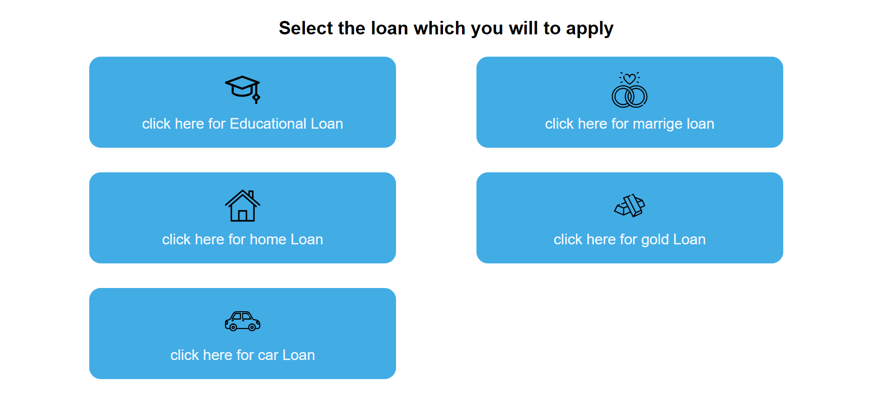
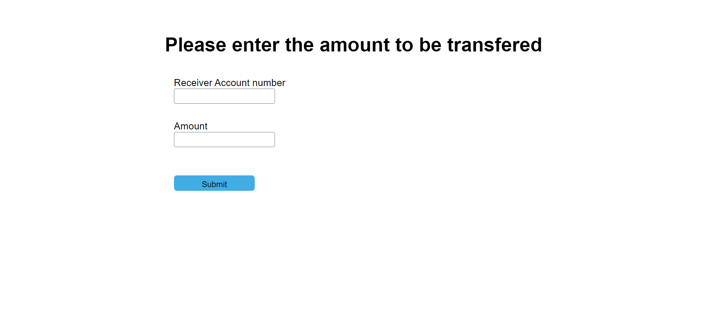

#  Bank Application system

 => Developed a Bank Application System using Java, J2EE,JSP, Servlets, HTML, CSS, and SQL to provide a userfriendly and efficient banking experience. 

 => The system addresses the fundamental needs of bank customers by facilitating smooth operations such as registration, login, balance inquiry, password management,fund transfer, statement retrieval, loan application, and
 logout, utilizing MySQL for robust data management

 

 => The system employs a Model-View-Controller (MVC) architecture and sessions to ensure secure and reliable handling of user data and transactions. By leveraging JDBC for database connectivity and MySQL for data
 storage.

## Result

